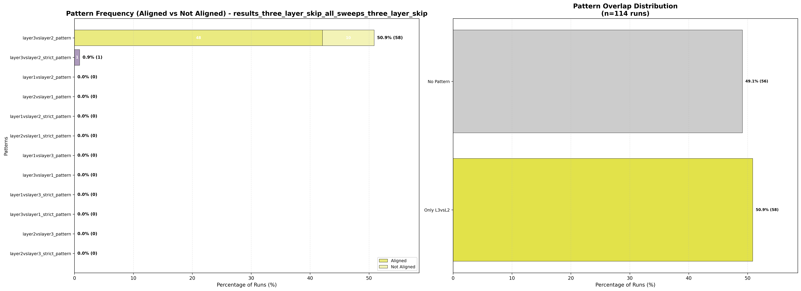
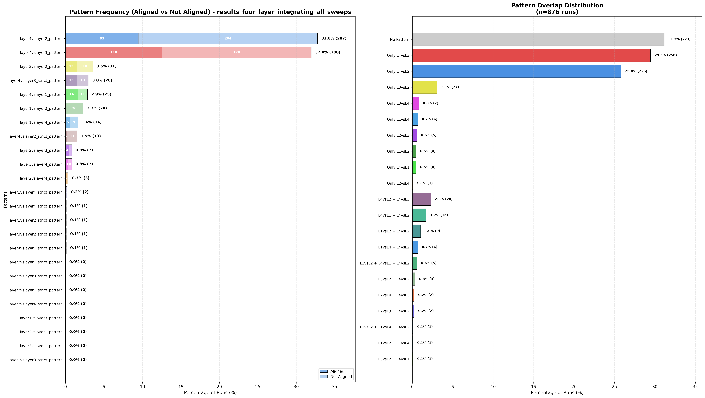
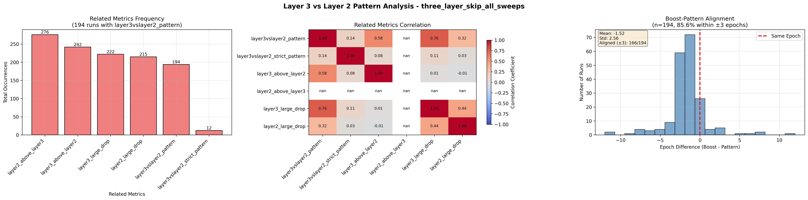
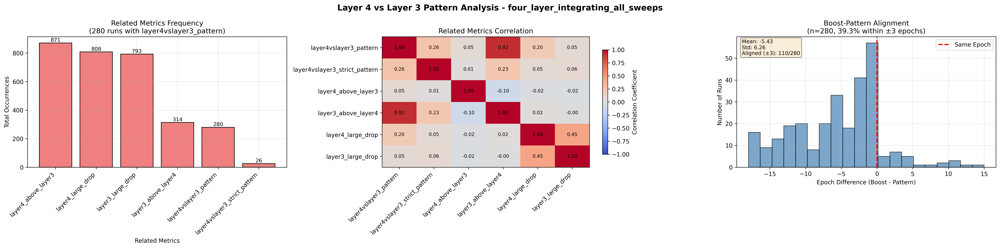
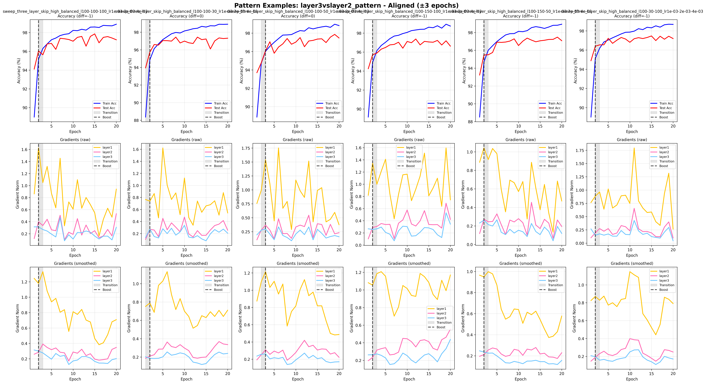
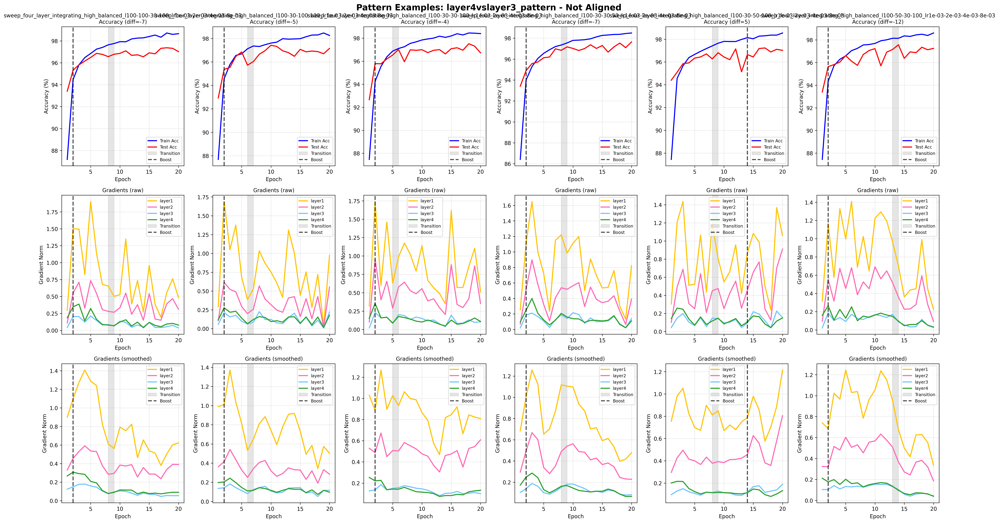

## nmlg_proj1
In-progress research code for analysing how gradient dynamics evolve during training in small neural networks across parameter sweeps. It supports multiple architectures and sweep dimensions (per-layer learning rates, layer sizes, and layer types), tracks gradients across training, and quantifies recurring patterns with several metrics.

## Layout

- `nmlg_proj1/models/`: architectures (`build_model(...)`)
- `nmlg_proj1/training/`: training loop
- `nmlg_proj1/data/`: dataset loading (MNIST-style)
- `nmlg_proj1/analysis/`: metrics + analysis
- `nmlg_proj1/plotting/`: plotting code (including `first_epoch/`)
- `nmlg_proj1/sweeps/`: sweep generators + sweep utilities

## Quickstart

Create a virtual environment and install dependencies (not pinned yet):

```bash
python -m venv .venv
source .venv/bin/activate
pip install torch torchvision numpy matplotlib pandas seaborn
```

## Train one run

```bash
python3 -m nmlg_proj1.training.run_one configs/<subfolder>/<config>.json
```

Outputs are written under `outputs/` (ignored by git).

## Run a sweep

Generate configs (examples):

```bash
python3 -m nmlg_proj1.sweeps.generators.generate_sweep_three_layer_skip --subfolder three_layer_skip_all_sweeps
python3 -m nmlg_proj1.sweeps.generators.generate_sweep_three_layer_skip_conv_uniform_lr --subfolder three_layer_skip_conv_uniform_lr
```

Run:

```bash
python3 -m nmlg_proj1.sweeps.run_sweep --subfolder <subfolder> --output-subfolder <subfolder>
```

## Analyze + plot

```bash
python3 -m nmlg_proj1.analysis.analyze_results --output-subfolder <subfolder>
python3 -m nmlg_proj1.plotting.plot_results --pattern-analysis --input-folder results/<subfolder>
```

## First-epoch activation/gradient tracking (optional)

```bash
python3 -m nmlg_proj1.analysis.first_epoch.run_activation_tracking --subfolder <subfolder>
python3 -m nmlg_proj1.analysis.first_epoch.analyze_activations_gradients_first_epoch --subfolder <subfolder>
python3 -m nmlg_proj1.plotting.first_epoch.plot_activations_gradients_first_epoch --subfolder <subfolder>
```

## Example results

### Summary pattern frequency (grouped by alignment to accuracy boost)
**Three-layer skip architecture:**


**Four-layer integrating architecture:**


### Summary correlation with other metrics
**Three-layer skip architecture:**


**Four-layer integrating architecture:**


### Examples of patterns (in aligned and misaligned cases)
**Three-layer skip architecture:**


**Four-layer integrating architecture:**



## What is (not) tracked

This repo ignores generated artifacts and local environment folders:
- ignored: `outputs/`, `results/`, `configs/`, `data/`, `.venv/`, `__pycache__/`
